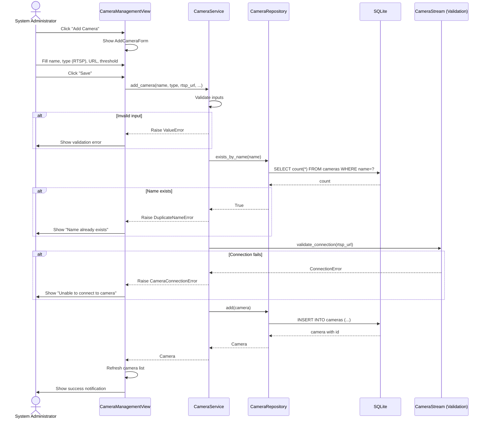
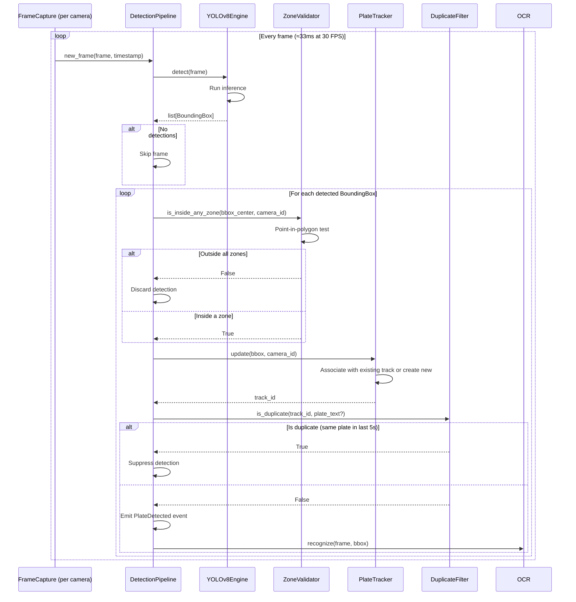
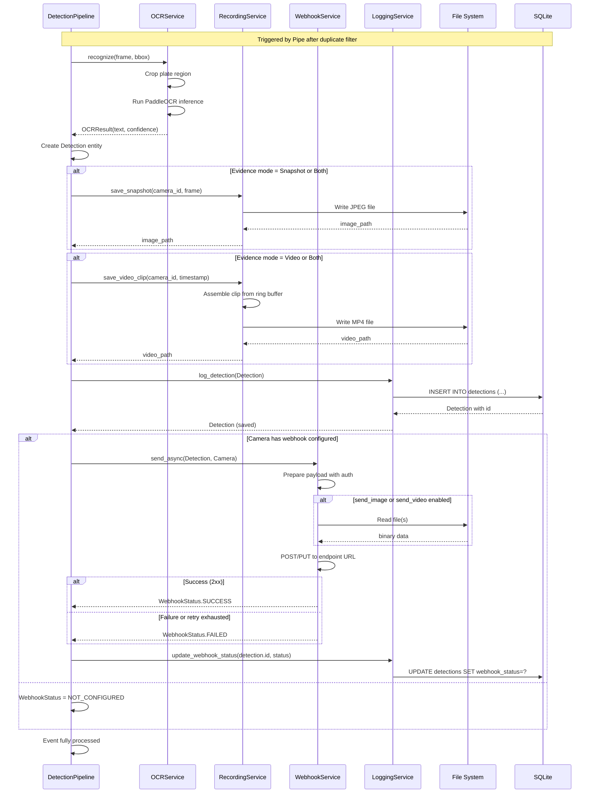
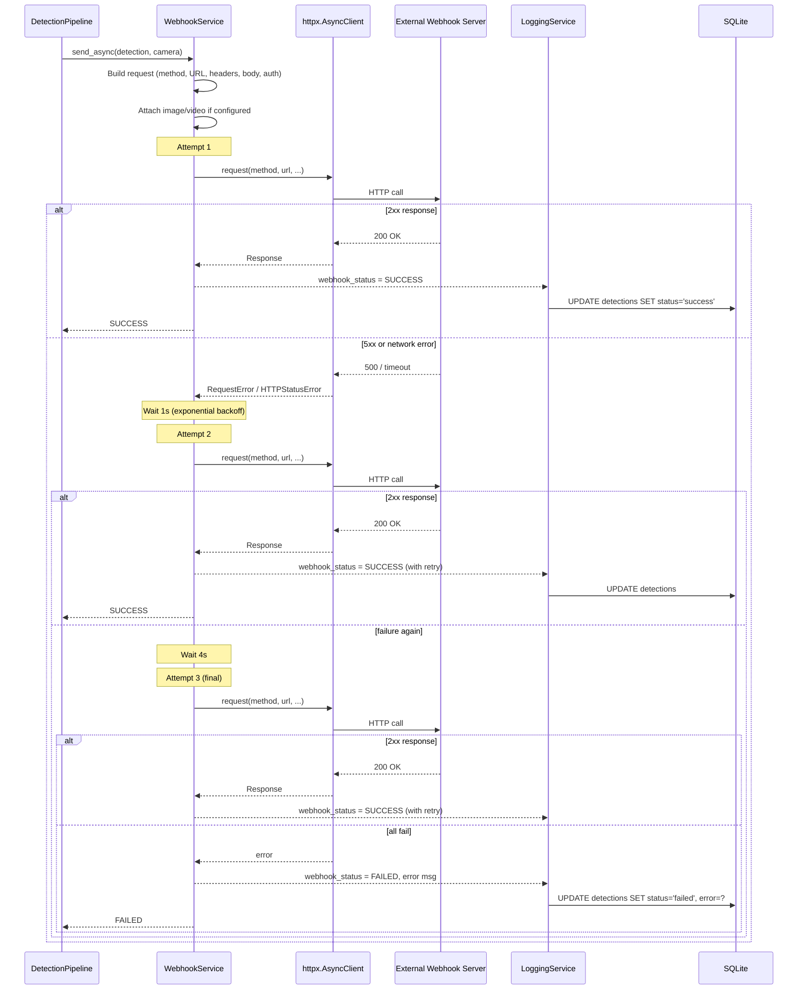
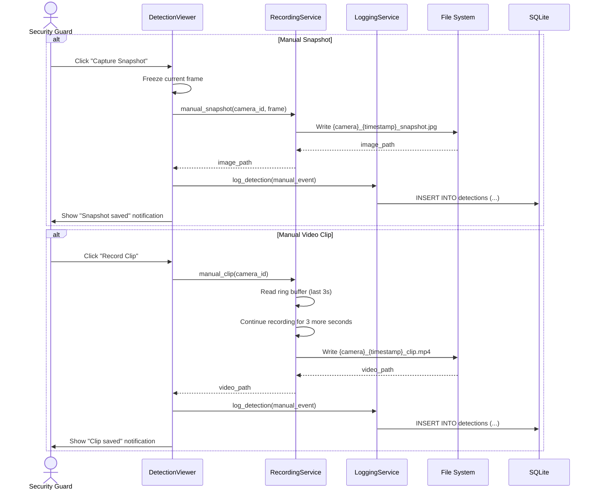
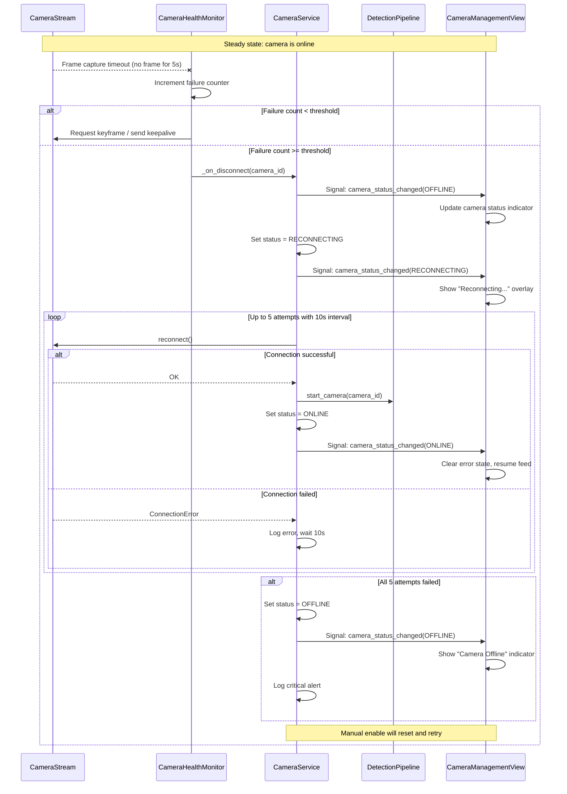
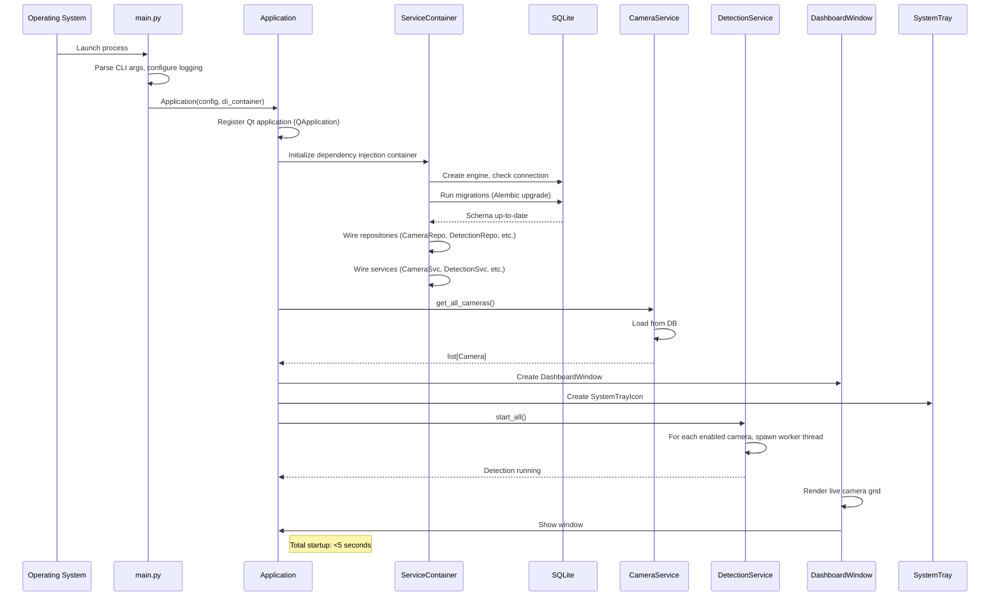
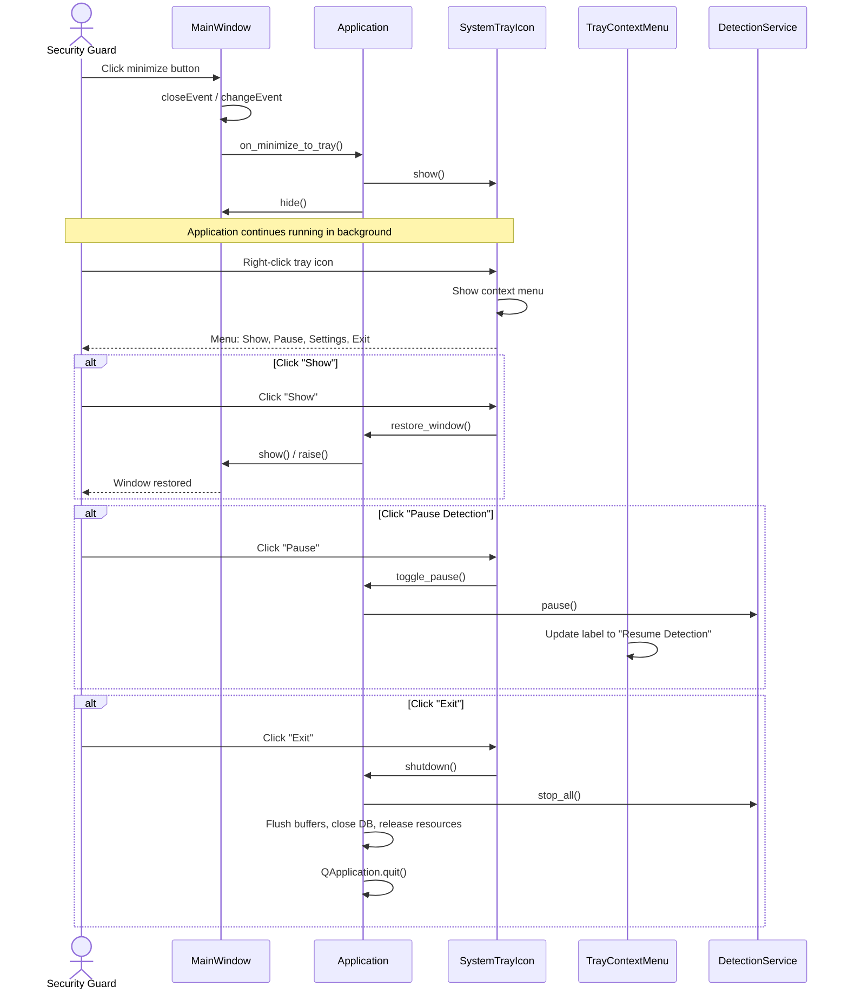

# Sequence Diagrams

> **Project:** Plate Guard — AI License Plate Recognition Desktop Application
> **Version:** 1.0
> **Date:** 2026-06-15

---

> All diagrams use Mermaid syntax. Render them with any Mermaid-compatible viewer or paste into a Mermaid live editor.

---

## 1. Add Camera Flow

---

## 2. Detection Pipeline (Inner Loop)

---

## 3. Full Detection Event (OCR → Evidence → Webhook → Log)

---

## 4. Webhook Delivery with Retry

---

## 5. Manual Evidence Capture

---

## 6. Camera Disconnect & Auto-Reconnect

---

## 7. Application Startup

---

## 8. Minimize to System Tray

